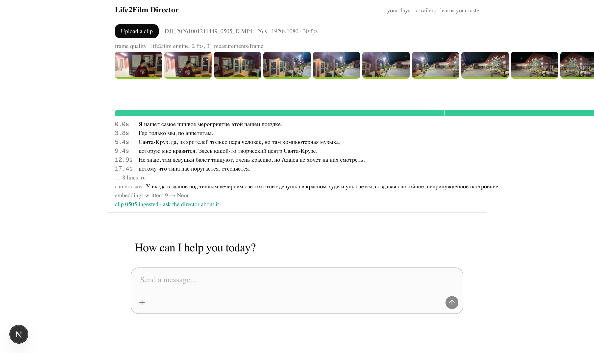
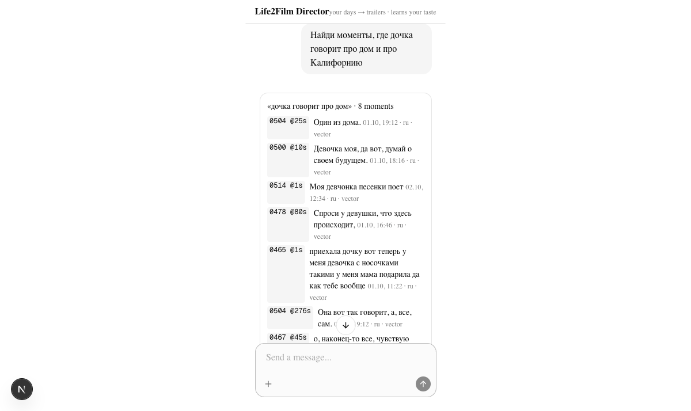
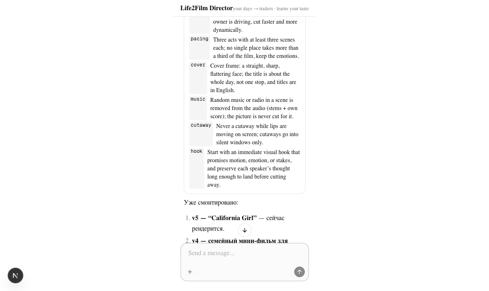

# Life2Film Director

A personal agent that turns a day of your own footage into a trailer, and learns your taste from every
correction you make.

Built solo at the **Build Personal Agents Hack** (Neon, Terra Gallery, San Francisco, 4 Oct 2026).
MIT licensed.

## What it does

1. **Knows your footage.** Clips from a DJI pocket camera and phones, with speech (whisper, word
   timings) and picture quality (31 measurements per frame, shot boundaries) in **Neon Postgres**:
   `days → clips → sentences / moments`. Old days come from the video-analyzer sidecars; new clips
   (shot today, or mailed to the agent's **AgentMail** inbox from a phone) are scored in Node by the
   [life2film-engine](https://www.npmjs.com/package/life2film-engine) WASM core, transcribed, and
   captioned by a vision model.
2. **Remembers like a family.** Every sentence and every clip caption has an embedding
   (`lakebase_vector`, cosine ANN) and a Russian+English `tsvector` (`lakebase_bm25`); `search_footage`
   fuses both with RRF. "Найди, где дочка говорит про дом" returns the clip, the second and the line;
   "закат у океана" finds the picture even when nobody spoke.
3. **Writes the script.** "Собери трейлер недели в долине, 3 минуты" → the director reads the whole
   week as text (2,367 sentences across 163 clips) and your standing rules, and writes `script.json`:
   a cold open, one hook line, three acts, speech kept as one track, cutaways that show what is being
   said, drives with their own sound.
4. **Renders it.** `vlog_cut.py` lays the script out as OpenTimelineIO, the Rust renderer cuts the mp4
   on the Mac (on Fly.io this is a sprite job). The render runs in the background; the chat card shows
   the renderer's progress lines and turns into a player with a poster when the file is ready.
5. **Learns.** "Первые 10 секунд скучные, нужен хук" → the remark becomes a durable rule
   (`rules` table), the script is revised, the opening re-cut. Ten rules were seeded from a month of
   real corrections; every new one is shown as a card.

## Screens

| Live analysis of an uploaded clip | Search card | Renders and rules |
|---|---|---|
|  |  |  |

Demo video (3 min): https://youtu.be/Zsj_Q_RUofM

## Stack (hack sponsors, each doing a real job)

| | |
|---|---|
| Neon Postgres | footage index, scripts, renders, the rules (taste graph), Mastra memory |
| Neon AI Gateway | LLM path when enabled; falls back to Anthropic / OpenAI (`src/lib/llm.ts`) |
| Mastra | the `director` agent and its tools (`src/mastra`) |
| assistant-ui | chat with generative cards: days, script timeline, player, rule learned |
| AgentMail | the agent's own inbox: clips sent from a phone become footage (`check_inbox`) |
| Exa | event / venue facts for captions and descriptions (next) |
| Kernel | posting the reel through a real browser (next) |
| Fly.io | hosting; renders as sprites (next) |

## Use it from your own agent (skill)

`skills/life2film-director/SKILL.md` is an agent skill: install with `npx skills add fortunto2/tech-week-agent`
(or point your agent at the file) and it gets the five install commands, the tool table and the failure
messages. The tools in `src/mastra/tools` are plain Mastra `createTool`s and work in any Mastra agent.

## Run

```bash
pnpm install
cp .env.example .env.local        # Neon DATABASE_URL, an LLM key, FOOTAGE_ROOT, VIDEO_ANALYZER_DIR/BIN
pnpm db:push                      # schema → Neon
pnpm seed:rules                   # the owner's editing rules
pnpm ingest ~/Movies/trip/day1 "Day 1" -5   # video-analyzer sidecars → Neon (tz offset for filename times)
pnpm ingest-clip ~/Movies/today/clip.MP4    # a clip with no sidecars: engine + whisper + caption
pnpm embed && pnpm caption                  # embeddings for sentences; VLM captions per clip
pnpm dev                                    # http://localhost:3000
```

The analysis sidecars (`*.va.stt.json`, `*.MP4.va.otio`) and the renderer come from the author's
open video-analyzer pipeline; the agent, schema, tools and UI were written during the hack.

## Layout

```
src/db/schema.ts            days, clips, sentences, moments, rules, scripts, renders, feedback
src/lib/sidecars.ts         readers for the analysis artefacts
src/lib/day-text.ts         the day as numbered text (what the director reads)
src/lib/script-schema.ts    script.json contract (+ validation against the footage)
src/mastra/agents/director.ts
src/lib/analyze.ts          life2film-engine (WASM) frame scoring + shot detection in Node
src/lib/search.ts           Lakebase hybrid search (vector + BM25, RRF) and picture search
src/lib/ingest-clip.ts      new clip → engine, whisper, caption, embeddings → Neon
src/mastra/tools/           list_days · search_footage · write_script · get_script · render_script · learn_rule · list_rules · list_renders · check_inbox
src/app/api/chat/route.ts   Mastra → AI SDK v7 stream → assistant-ui
src/app/tool-ui.tsx         generative cards per tool
scripts/ingest.ts           folder → Neon
```
